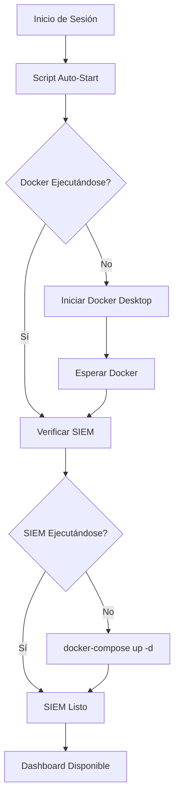

# 🚀 Configuración de Inicio Automático del SIEM

Este documento explica cómo configurar el SIEM OpenSource PyMES para que se inicie automáticamente al arrancar el sistema o al iniciar sesión.

## ✅ Estado Actual

**¡El inicio automático ya está configurado y funcionando!**

- ✅ SIEM ejecutándose: `http://localhost`
- ✅ Inicio automático habilitado para el usuario actual
- ✅ Se iniciará automáticamente al iniciar sesión

## 🎯 URLs de Acceso

| Servicio | URL | Descripción |
|----------|-----|-------------|
| **Dashboard Principal** | http://localhost | Interfaz unificada de control |
| **Kibana** | http://localhost:5601 | Análisis y visualización de logs |
| **Grafana** | http://localhost:3000 | Métricas y monitoreo |
| **Elasticsearch** | http://localhost:9200 | API de búsqueda (técnico) |

## 📋 Scripts Disponibles

### 1. `auto-start-user.ps1` (Recomendado)
**Configuración a nivel de usuario - NO requiere permisos de administrador**

```powershell
# Instalar inicio automático
.\auto-start-user.ps1 -Action install

# Verificar estado
.\auto-start-user.ps1 -Action status

# Desinstalar inicio automático
.\auto-start-user.ps1 -Action uninstall
```

### 2. `auto-start-siem.ps1` (Avanzado)
**Configuración a nivel de sistema - Requiere permisos de administrador**

```powershell
# Ejecutar PowerShell como Administrador, luego:
.\auto-start-siem.ps1 -Action install
```

### 3. `start-siem-user.ps1` (Generado automáticamente)
**Script de inicio directo**

```powershell
# Iniciar SIEM manualmente
.\start-siem-user.ps1
```

## 🔧 Cómo Funciona

### Inicio Automático de Usuario (Actual)
1. **Registro de Windows**: Se agrega una entrada en `HKCU:\Software\Microsoft\Windows\CurrentVersion\Run`
2. **Al iniciar sesión**: Windows ejecuta automáticamente el script
3. **Verificación de Docker**: El script verifica que Docker esté ejecutándose
4. **Inicio del SIEM**: Ejecuta `docker-compose up -d`
5. **Logs**: Registra toda la actividad en `logs/auto-start-user.log`

### Proceso de Inicio


## 📊 Verificación del Estado

### Comando de Estado
```powershell
.\auto-start-user.ps1 -Action status
```

### Salida Esperada
```
[INFO] Inicio automático: HABILITADO
[INFO] Estado del SIEM: EJECUTÁNDOSE
[INFO] Dashboard disponible en: http://localhost
[INFO] Estado de Docker: EJECUTÁNDOSE
```

### Verificación Manual
```powershell
# Ver contenedores ejecutándose
docker-compose ps

# Ver logs del SIEM
docker-compose logs -f

# Verificar servicios específicos
docker-compose logs kibana
docker-compose logs grafana
```

## 🛠️ Solución de Problemas

### Problema: Docker no se inicia automáticamente
**Solución:**
```powershell
# Verificar si Docker Desktop está instalado
Get-Process "Docker Desktop" -ErrorAction SilentlyContinue

# Iniciar Docker Desktop manualmente
Start-Process "C:\Program Files\Docker\Docker\Docker Desktop.exe"
```

### Problema: SIEM no se inicia al iniciar sesión
**Diagnóstico:**
```powershell
# Verificar entrada en el registro
Get-ItemProperty -Path "HKCU:\Software\Microsoft\Windows\CurrentVersion\Run" -Name "SIEM-AutoStart"

# Ver logs de inicio
Get-Content .\logs\auto-start-user.log -Tail 20
```

### Problema: Servicios en estado "Restarting"
**Solución:**
```powershell
# Reiniciar servicios problemáticos
docker-compose restart

# Ver logs específicos
docker-compose logs [nombre-servicio]

# Ejemplo: Ver logs de Kibana
docker-compose logs kibana
```

### Problema: Puerto ocupado
**Solución:**
```powershell
# Verificar qué está usando el puerto 80
netstat -ano | findstr :80

# Detener SIEM y reiniciar
docker-compose down
docker-compose up -d
```

## 📁 Archivos de Log

| Archivo | Descripción |
|---------|-------------|
| `logs/auto-start-user.log` | Logs del script de inicio automático |
| `data/nginx/logs/` | Logs del servidor web Nginx |
| `docker-compose logs` | Logs de todos los contenedores |

## 🔄 Comandos Útiles

### Gestión del SIEM
```powershell
# Iniciar SIEM
docker-compose up -d

# Detener SIEM
docker-compose down

# Reiniciar SIEM
docker-compose restart

# Ver estado
docker-compose ps

# Ver logs en tiempo real
docker-compose logs -f

# Actualizar servicios
docker-compose pull
docker-compose up -d
```

### Gestión del Inicio Automático
```powershell
# Verificar estado
.\auto-start-user.ps1 -Action status

# Reinstalar configuración
.\auto-start-user.ps1 -Action uninstall
.\auto-start-user.ps1 -Action install

# Probar inicio manual
.\start-siem-user.ps1
```

## 🔒 Consideraciones de Seguridad

1. **Inicio Automático**: Solo se configura para el usuario actual
2. **Permisos**: No requiere permisos de administrador
3. **Docker**: Asegúrate de que Docker Desktop esté configurado correctamente
4. **Firewall**: Verifica que los puertos 80, 3000, 5601 estén permitidos

## 📞 Soporte

Si tienes problemas:

1. **Revisa los logs**: `Get-Content .\logs\auto-start-user.log`
2. **Verifica Docker**: `docker info`
3. **Comprueba el estado**: `.\auto-start-user.ps1 -Action status`
4. **Reinicia el sistema**: Para probar el inicio automático completo

---

**¡El SIEM está configurado y listo para usar!** 🎉

Accede al dashboard principal en: **http://localhost**