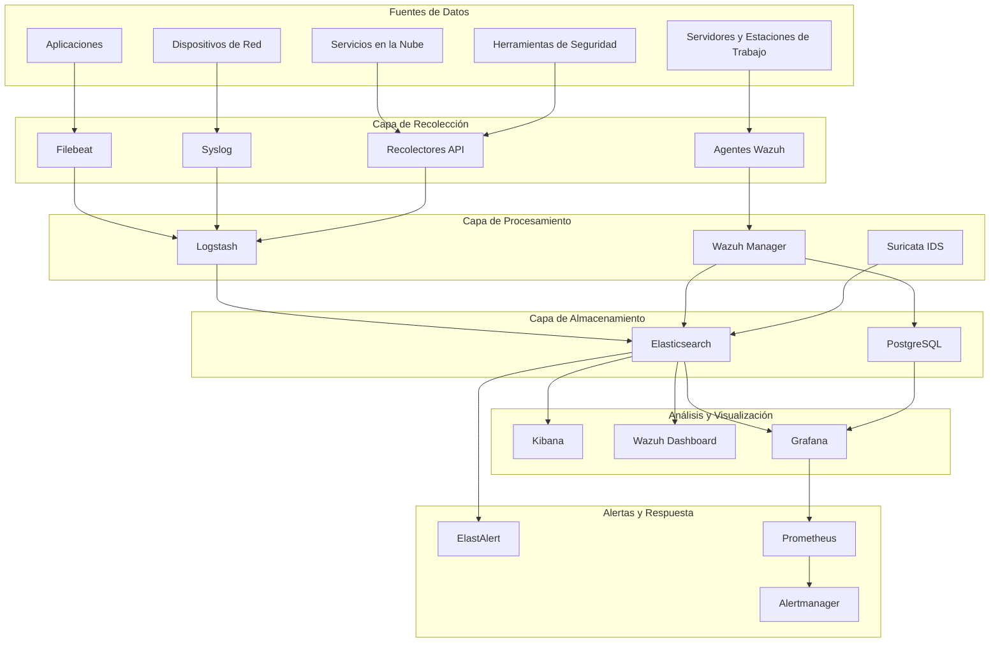

# SIEM OpenSource PyMES

<div align="center">


**Una solución integral de código abierto para Gestión de Información y Eventos de Seguridad (SIEM) diseñada específicamente para pequeñas y medianas empresas (PyMES)**

[🚀 Inicio Rápido](#inicio-rápido) • [📖 Documentación](#documentación) • [🛠️ Instalación](#instalación) • [🔧 Configuración](#configuración) • [🤝 Contribuir](#contribuir)

</div>

## 🌟 Descripción General

SIEM OpenSource PyMES es una solución completa de monitoreo de seguridad de nivel empresarial que combina el poder de herramientas de código abierto líderes en la industria en una plataforma unificada y fácil de implementar. Diseñada pensando en pequeñas y medianas empresas, proporciona monitoreo integral de seguridad, detección de amenazas y reportes de cumplimiento sin la complejidad y el costo de las soluciones comerciales.

### 🎯 Características Principales

- **🔍 Monitoreo de Seguridad en Tiempo Real**: Monitoreo continuo de logs, eventos y alertas de seguridad
- **🚨 Detección Avanzada de Amenazas**: Detección de anomalías basada en aprendizaje automático e integración de inteligencia de amenazas
- **📊 Dashboards Integrales**: Dashboards preconfigurados para operaciones de seguridad, cumplimiento y monitoreo de rendimiento
- **🔐 Recolección de Logs Multi-fuente**: Soporte para syslog, Logs de Eventos de Windows, dispositivos de red, servicios en la nube y más
- **⚡ Respuesta Automatizada**: Respuestas automatizadas configurables a incidentes de seguridad
- **📋 Reportes de Cumplimiento**: Soporte integrado para GDPR, HIPAA, PCI DSS, SOX e ISO 27001
- **🌐 Listo para la Nube**: Implementar en las instalaciones, en la nube o en entornos híbridos
- **📈 Arquitectura Escalable**: Crece con tu organización desde un solo servidor hasta clústeres distribuidos

### 🏗️ Arquitectura



## 🚀 Inicio Rápido

### Prerrequisitos

- **Sistema Operativo**: Windows 10/11, Ubuntu 20.04+, CentOS 8+, o macOS 10.15+
- **Hardware**: 4+ núcleos de CPU, 8+ GB RAM, 50+ GB almacenamiento
- **Software**: Docker 24.0+, Docker Compose 2.0+, Git

### 🐳 Implementación con Docker (Recomendado)

```bash
# Clonar el repositorio
git clone https://github.com/ismaiars/siem-pymes.git
cd siem-pymes

# Inicio rápido con configuración predeterminada
docker-compose up -d

# Esperar a que los servicios se inicialicen (2-3 minutos)
docker-compose logs -f
```

### 🪟 Windows PowerShell

```powershell
# Clonar e implementar
git clone https://github.com/ismaiars/siem-pymes.git
cd siem-pymes
.\install.ps1 -Mode quick
```

### 🐧 Linux/macOS

```bash
# Clonar e implementar
git clone https://github.com/ismaiars/siem-pymes.git
cd siem-pymes
chmod +x install.sh
./install.sh --mode quick
```

### 🌐 Acceder al SIEM

Después de la implementación, accede a las interfaces web:

| Servicio | URL | Credenciales Predeterminadas |
|---------|-----|------------------------------|
| **Kibana** (Dashboard Principal) | http://localhost:5601 | elastic / changeme |
| **Wazuh Dashboard** | http://localhost | admin / admin |
| **Grafana** (Métricas) | http://localhost:3000 | admin / admin |
| **Prometheus** (Monitoreo) | http://localhost:9090 | - |

> ⚠️ **Advertencia de Seguridad**: ¡Cambia las contraseñas predeterminadas inmediatamente después del primer inicio de sesión!

## 📦 Componentes

### Componentes Principales

| Componente | Versión | Propósito | Puerto |
|-----------|---------|-----------|--------|
| **Elasticsearch** | 8.11.0 | Motor de búsqueda y análisis | 9200 |
| **Kibana** | 8.11.0 | Visualización y exploración de datos | 5601 |
| **Logstash** | 8.11.0 | Pipeline de procesamiento de datos | 5044 |
| **Wazuh Manager** | 4.7.0 | Monitoreo de seguridad y HIDS | 1514 |
| **Wazuh Dashboard** | 4.7.0 | Interfaz de operaciones de seguridad | 443 |
| **Suricata** | 7.0.2 | Detección de intrusiones de red | - |
| **Grafana** | 10.2.0 | Visualización de métricas | 3000 |
| **Prometheus** | 2.47.0 | Recolección y almacenamiento de métricas | 9090 |
| **PostgreSQL** | 15.0 | Base de datos relacional | 5432 |
| **Redis** | 7.2.0 | Caché y almacenamiento de sesiones | 6379 |

### Herramientas Adicionales

- **ElastAlert**: Alertas en tiempo real para Elasticsearch
- **Filebeat**: Recolector ligero de logs
- **Metricbeat**: Recolector de métricas del sistema y servicios
- **Nginx**: Proxy inverso y balanceador de carga
- **Certbot**: Gestión de certificados SSL

## 🛠️ Instalación

### Opciones de Implementación

#### 1. 🏠 Desarrollo Local

```bash
# Entorno de desarrollo con recarga en caliente
./install.sh --mode development
```

#### 2. 🏢 Producción On-Premises

```bash
# Implementación de producción con SSL y endurecimiento de seguridad
./install.sh --mode production --generate-ssl --enable-security
```

#### 3. ☁️ Implementación en la Nube

```bash
# Implementar en AWS, Azure o GCP usando Terraform
cd terraform
cp terraform.tfvars.example terraform.tfvars
# Editar terraform.tfvars con tu configuración de nube
terraform init
terraform apply
```

#### 4. ⚓ Implementación en Kubernetes

```bash
# Implementar en clúster de Kubernetes
helm repo add siem-pymes https://charts.siem-pymes.org
helm install siem-pymes siem-pymes/siem-stack --namespace siem-system --create-namespace
```

### Requisitos del Sistema

#### Requisitos Mínimos
- **CPU**: 4 núcleos
- **RAM**: 8 GB
- **Almacenamiento**: 50 GB SSD
- **Red**: 100 Mbps

#### Requisitos Recomendados
- **CPU**: 8+ núcleos
- **RAM**: 16+ GB
- **Almacenamiento**: 200+ GB NVMe SSD
- **Red**: 1+ Gbps

#### Requisitos Empresariales
- **CPU**: 16+ núcleos
- **RAM**: 32+ GB
- **Almacenamiento**: 1+ TB NVMe SSD (RAID 10)
- **Red**: 10+ Gbps

## 🔧 Configuración

### Configuración del Entorno

```bash
# Copiar y personalizar archivo de entorno
cp .env.example .env
nano .env  # Editar configuración
```

### Opciones de Configuración Principales

```bash
# Configuración del Proyecto
PROJECT_NAME=siem-pymes
ENVIRONMENT=production
TIMEZONE=UTC

# Configuración de Seguridad
ELASTIC_PASSWORD=tu-contraseña-segura
KIBANA_PASSWORD=tu-contraseña-segura
WAZUH_API_PASSWORD=tu-contraseña-segura
GRAFANA_ADMIN_PASSWORD=tu-contraseña-segura

# Configuración SSL
SSL_ENABLED=true
SSL_CERT_PATH=/opt/siem/ssl/server-cert.pem
SSL_KEY_PATH=/opt/siem/ssl/server-key.pem

# Configuración de Rendimiento
ELASTIC_HEAP_SIZE=4g
LOGSTASH_HEAP_SIZE=2g
WAZUH_INDEXER_HEAP_SIZE=2g

# Retención de Datos
LOG_RETENTION_DAYS=90
METRICS_RETENTION_DAYS=30
ALERT_RETENTION_DAYS=365

# Cumplimiento
COMPLIANCE_MODE=true
COMPLIANCE_FRAMEWORKS=GDPR,HIPAA,PCI-DSS
```

## 📚 Documentación

### Guías de Usuario

- [📖 Guía de Implementación](DEPLOYMENT.md) - Instrucciones completas de implementación
- [👤 Manual de Usuario](USER_MANUAL.md) - Documentación para usuarios finales
- [🔧 Guía de Configuración](CONFIGURATION.md) - Opciones detalladas de configuración
- [🚨 Guía de Respuesta a Incidentes](INCIDENT_RESPONSE.md) - Procedimientos de incidentes de seguridad
- [🛠️ Guía de Solución de Problemas](TROUBLESHOOTING.md) - Problemas comunes y soluciones

### Documentación Técnica

- [🏗️ Guía de Arquitectura](ARCHITECTURE.md) - Arquitectura y diseño del sistema
- [🔌 Documentación de API](API.md) - Referencia de API REST
- [🧩 Guía de Integración](INTEGRATIONS.md) - Integraciones con terceros
- [🔒 Guía de Seguridad](SECURITY.md) - Mejores prácticas de seguridad
- [📊 Guía de Rendimiento](PERFORMANCE.md) - Optimización y ajuste de rendimiento

## 🤝 Contribuir

¡Damos la bienvenida a las contribuciones de la comunidad! Por favor lee nuestra [Guía de Contribución](CONTRIBUTING.md) para detalles sobre:

- Código de conducta
- Proceso de desarrollo
- Envío de pull requests
- Reporte de errores
- Solicitud de características

## 📄 Licencia

Este proyecto está licenciado bajo la Licencia MIT - consulta el archivo [LICENSE](LICENSE) para más detalles.

## 📞 Soporte

### Soporte de la Comunidad

- 💬 [Servidor Discord](https://discord.gg/siem-pymes) - Chat en tiempo real y soporte
- 🐛 [Issues de GitHub](https://github.com/ismaiars/siem-pymes/issues) - Reportes de errores y solicitudes de características
- 📖 [Wiki de Documentación](https://wiki.siem-pymes.org) - Documentación mantenida por la comunidad

### Soporte Profesional

- 🏢 **Soporte Empresarial**: Paquetes de soporte comercial disponibles
- 🎓 **Servicios de Capacitación**: Capacitación profesional y certificación
- 🔧 **Servicios de Consultoría**: Servicios de implementación y personalización

Para consultas de soporte profesional, contacta: support@siem-pymes.org

---

<div align="center">

**Hecho con ❤️ por la Comunidad SIEM PyMES**

[⭐ Danos una estrella en GitHub](https://github.com/ismaiars/siem-pymes) • [🐛 Reportar Problemas](https://github.com/ismaiars/siem-pymes/issues) • [💬 Únete a Discord](https://discord.gg/siem-pymes)

</div>