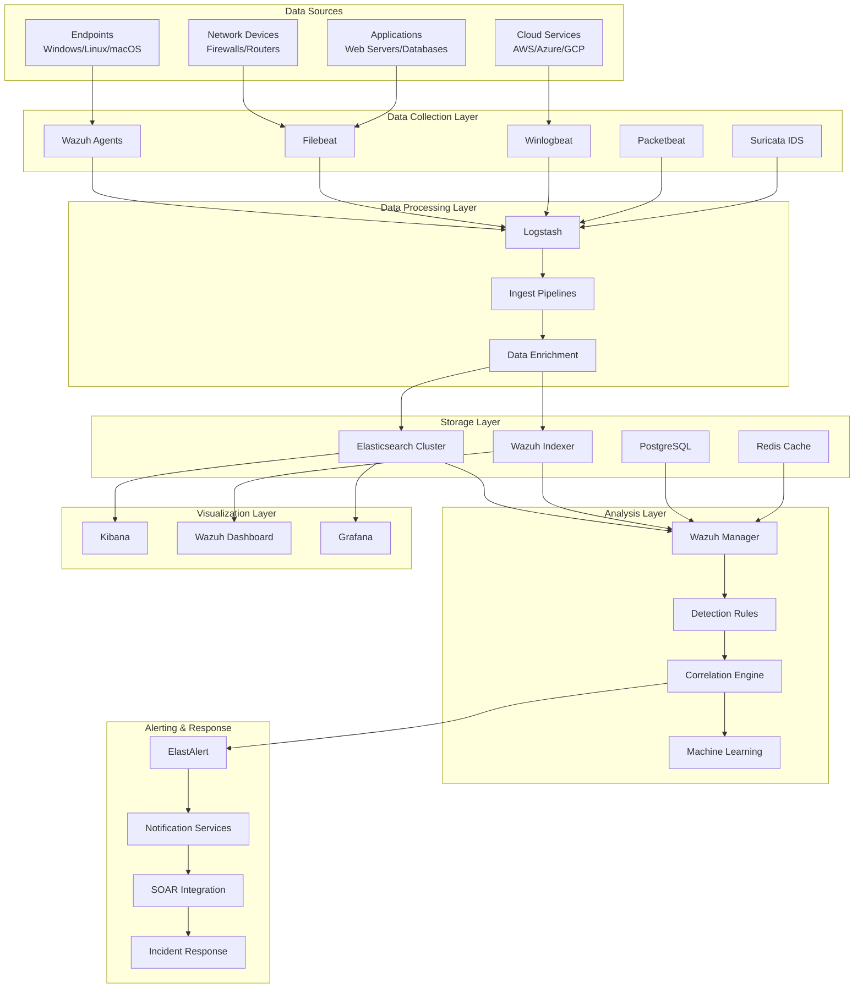

# Arquitectura del SIEM OpenSource PyMES

## 🏗️ Visión General

Este documento describe la arquitectura técnica del SIEM OpenSource PyMES, diseñado para proporcionar capacidades de detección, análisis y respuesta a incidentes de seguridad para pequeñas y medianas empresas.

## 📊 Diagrama de Arquitectura



## 🔧 Componentes Principales

### 1. Capa de Recolección de Datos

#### Wazuh Agents
- **Propósito**: Monitoreo de endpoints en tiempo real
- **Características**:
  - File Integrity Monitoring (FIM)
  - Log analysis y correlation
  - Rootkit detection
  - Active response
  - Vulnerability assessment
- **Plataformas**: Windows, Linux, macOS, Solaris, AIX

#### Beats (Elastic Stack)
- **Filebeat**: Recolección de logs de archivos
- **Winlogbeat**: Logs de eventos de Windows
- **Packetbeat**: Análisis de tráfico de red
- **Metricbeat**: Métricas del sistema y servicios

#### Suricata IDS
- **Propósito**: Detección de intrusiones de red
- **Características**:
  - Deep packet inspection
  - Protocol analysis
  - Threat intelligence integration
  - File extraction y analysis

### 2. Capa de Procesamiento

#### Logstash
- **Función**: ETL (Extract, Transform, Load)
- **Capacidades**:
  - Parsing de logs con Grok patterns
  - Data enrichment (GeoIP, DNS lookup)
  - Field normalization
  - Output routing

#### Ingest Pipelines
- **ECS Mapping**: Normalización a Elastic Common Schema
- **Data Validation**: Verificación de integridad
- **Enrichment**: Agregación de contexto

### 3. Capa de Almacenamiento

#### Elasticsearch Cluster
```
┌─────────────────┐    ┌─────────────────┐    ┌─────────────────┐
│   Master Node   │    │   Data Node 1   │    │   Data Node 2   │
│   (Coordina)    │────│   (Hot Tier)    │────│   (Warm Tier)   │
└─────────────────┘    └─────────────────┘    └─────────────────┘
         │                       │                       │
         └───────────────────────┼───────────────────────┘
                                 │
                    ┌─────────────────┐
                    │   Data Node 3   │
                    │   (Cold Tier)   │
                    └─────────────────┘
```

**Configuración de Tiers**:
- **Hot Tier**: Datos recientes (0-7 días) - SSD NVMe
- **Warm Tier**: Datos frecuentes (7-30 días) - SSD SATA
- **Cold Tier**: Datos archivados (30+ días) - HDD

#### Index Lifecycle Management (ILM)
```yaml
Policy: siem-logs-policy
Phases:
  - Hot: 7 days (50GB max)
  - Warm: 30 days (compress, reduce replicas)
  - Cold: 365 days (searchable snapshots)
  - Delete: After 365 days
```

### 4. Capa de Análisis

#### Wazuh Manager
- **Rules Engine**: 3000+ reglas predefinidas
- **Decoders**: Parseo de logs estructurados
- **CDB Lists**: Listas de IOCs y whitelist
- **Active Response**: Respuesta automatizada

#### Detection Rules
```
Tipos de Reglas:
├── Frequency Rules (Detección por frecuencia)
├── Correlation Rules (Correlación de eventos)
├── Composite Rules (Reglas compuestas)
├── If-Then Rules (Lógica condicional)
└── Machine Learning Rules (Anomalías)
```

### 5. Capa de Visualización

#### Dashboards Principales
1. **Executive Dashboard**
   - KPIs de seguridad
   - Tendencias de amenazas
   - Compliance status

2. **SOC Dashboard**
   - Alertas en tiempo real
   - Investigación de incidentes
   - Threat hunting

3. **Infrastructure Dashboard**
   - Health del SIEM
   - Performance metrics
   - Capacity planning

## 🔒 Seguridad de la Arquitectura

### Network Segmentation
```
┌─────────────────────────────────────────────────────────────┐
│                        DMZ Network                          │
│  ┌─────────────┐    ┌─────────────┐    ┌─────────────┐     │
│  │   Firewall  │────│ Load Balancer│────│ Reverse Proxy│     │
│  └─────────────┘    └─────────────┘    └─────────────┘     │
└─────────────────────────────────────────────────────────────┘
                                │
┌─────────────────────────────────────────────────────────────┐
│                    SIEM Internal Network                    │
│  ┌─────────────┐    ┌─────────────┐    ┌─────────────┐     │
│  │ Elasticsearch│────│   Kibana    │────│   Wazuh     │     │
│  │   Cluster   │    │  Dashboard  │    │  Manager    │     │
│  └─────────────┘    └─────────────┘    └─────────────┘     │
└─────────────────────────────────────────────────────────────┘
                                │
┌─────────────────────────────────────────────────────────────┐
│                   Management Network                        │
│  ┌─────────────┐    ┌─────────────┐    ┌─────────────┐     │
│  │   Bastion   │────│   Ansible   │────│   Backup    │     │
│  │    Host     │    │   Tower     │    │   Server    │     │
│  └─────────────┘    └─────────────┘    └─────────────┘     │
└─────────────────────────────────────────────────────────────┘
```

### Security Controls

1. **Authentication & Authorization**
   - LDAP/Active Directory integration
   - Role-based access control (RBAC)
   - Multi-factor authentication (MFA)
   - API key management

2. **Encryption**
   - TLS 1.3 for all communications
   - Encryption at rest (AES-256)
   - Certificate management
   - Key rotation policies

3. **Monitoring & Auditing**
   - Admin access logging
   - Configuration change tracking
   - Performance monitoring
   - Security event correlation

## 📈 Escalabilidad y Performance

### Horizontal Scaling

#### Elasticsearch Scaling
```yaml
Small Environment (< 1GB/day):
  - 1 Master node: 2 vCPU, 4GB RAM
  - 2 Data nodes: 4 vCPU, 8GB RAM
  - Storage: 100GB SSD

Medium Environment (1-10GB/day):
  - 3 Master nodes: 2 vCPU, 4GB RAM
  - 4 Data nodes: 8 vCPU, 16GB RAM
  - Storage: 500GB SSD

Large Environment (10-100GB/day):
  - 3 Master nodes: 4 vCPU, 8GB RAM
  - 6+ Data nodes: 16 vCPU, 32GB RAM
  - Storage: 2TB+ SSD
```

#### Auto-scaling Triggers
- CPU utilization > 80%
- Memory utilization > 85%
- Disk usage > 80%
- Queue depth > 1000 events

### Performance Optimization

1. **Indexing Optimization**
   - Bulk indexing (1000-5000 docs/batch)
   - Index templates optimization
   - Mapping optimization
   - Refresh interval tuning

2. **Query Optimization**
   - Query caching
   - Field data caching
   - Aggregation optimization
   - Time-based filtering

3. **Resource Allocation**
   - JVM heap sizing (50% of RAM, max 32GB)
   - Thread pool optimization
   - Circuit breaker configuration
   - Memory mapping optimization

## 🔄 High Availability

### Cluster Configuration

```yaml
Elasticsearch HA:
  minimum_master_nodes: 2
  discovery.zen.ping.unicast.hosts:
    - es-master-01
    - es-master-02
    - es-master-03
  
Wazuh HA:
  cluster:
    node_name: wazuh-master
    node_type: master
    key: "your-cluster-key"
    nodes:
      - wazuh-master
      - wazuh-worker-01
      - wazuh-worker-02
```

### Backup Strategy

1. **Elasticsearch Snapshots**
   - Daily snapshots to S3/Azure Blob
   - Incremental backups
   - Cross-region replication
   - Automated restore testing

2. **Configuration Backups**
   - Git-based configuration management
   - Automated configuration snapshots
   - Disaster recovery procedures

### Disaster Recovery

**RTO (Recovery Time Objective)**: 4 hours
**RPO (Recovery Point Objective)**: 1 hour

**Recovery Procedures**:
1. Infrastructure provisioning (Terraform)
2. Configuration restoration (Ansible)
3. Data restoration (Elasticsearch snapshots)
4. Service validation and testing

## 🔍 Monitoring y Observabilidad

### Health Monitoring

```yaml
Health Checks:
  - Elasticsearch cluster health
  - Wazuh manager status
  - Kibana availability
  - Data ingestion rate
  - Alert processing latency
  - Storage utilization
  - Network connectivity
```

### Metrics Collection

1. **Infrastructure Metrics**
   - CPU, Memory, Disk, Network
   - Container metrics (Docker/K8s)
   - Application performance

2. **SIEM Metrics**
   - Events per second (EPS)
   - Alert generation rate
   - False positive rate
   - Mean time to detection (MTTD)
   - Mean time to response (MTTR)

3. **Business Metrics**
   - Security incidents
   - Compliance status
   - Risk assessment
   - Cost per event processed

## 🚀 Deployment Patterns

### Development Environment
```yaml
Docker Compose:
  - Single node Elasticsearch
  - Kibana
  - Wazuh Manager
  - Basic monitoring
  
Resources:
  - 8GB RAM minimum
  - 4 vCPU
  - 100GB storage
```

### Production Environment
```yaml
Kubernetes:
  - Multi-node Elasticsearch cluster
  - High availability Wazuh
  - Load balancing
  - Auto-scaling
  - Monitoring stack
  
Resources:
  - 64GB+ RAM
  - 16+ vCPU
  - 1TB+ storage
```

### Cloud Deployment
```yaml
AWS:
  - EKS for container orchestration
  - EBS for persistent storage
  - ALB for load balancing
  - S3 for backups
  - CloudWatch for monitoring
  
Azure:
  - AKS for container orchestration
  - Azure Disks for storage
  - Application Gateway
  - Blob Storage for backups
  - Azure Monitor
```

## 📋 Compliance y Auditoría

### Standards Supported
- **ISO 27001**: Information Security Management
- **NIST Cybersecurity Framework**: Risk management
- **PCI DSS**: Payment card industry security
- **GDPR**: Data protection and privacy
- **SOX**: Financial reporting controls

### Audit Trail
```yaml
Audit Events:
  - User authentication/authorization
  - Configuration changes
  - Data access and modification
  - System administration
  - Alert acknowledgment
  - Incident response actions
```

### Retention Policies
- **Security Events**: 1 year minimum
- **Audit Logs**: 7 years
- **Configuration Changes**: 3 years
- **Performance Metrics**: 90 days

## 🔮 Roadmap y Evolución

### Próximas Características
1. **Machine Learning Avanzado**
   - User Behavior Analytics (UBA)
   - Anomaly detection
   - Threat hunting automation

2. **Integración SOAR**
   - Phantom/Splunk SOAR
   - TheHive integration
   - Automated playbooks

3. **Threat Intelligence**
   - MISP integration
   - IOC enrichment
   - Threat hunting feeds

4. **Cloud Security**
   - AWS CloudTrail integration
   - Azure Activity Logs
   - GCP Audit Logs
   - Container security monitoring

### Tecnologías Emergentes
- **Extended Detection and Response (XDR)**
- **Security Data Lake**
- **AI-powered threat detection**
- **Zero Trust Architecture integration**

---

**Documento mantenido por**: Equipo de Arquitectura SIEM  
**Última actualización**: Diciembre 2024  
**Versión**: 1.0  
**Próxima revisión**: Marzo 2025